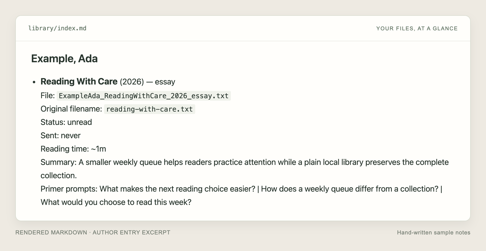

<div align="center">

# Reading Librarian

**A little order for your reading backlog.**

Turn a folder of saved readings into a tidy library you can understand at a glance.

[](https://github.com/Spencer-Norwick/librarian/actions/workflows/tests.yml)
[](https://www.python.org/downloads/)
[](LICENSE)

[Get started](#get-started) · [Try the demo](docs/examples.md) · [Usage guide](docs/usage.md)

</div>

Reading Librarian is a small terminal tool for PDFs, EPUBs, essays, and saved text. Drop files into `inbox/`, preview their new names, and add them to a plain-file library with one readable Markdown index.


*Actual CLI output from the [included demo](docs/examples.md), using an invented essay.*

- **Find things again.** Consistent filenames, original names preserved in the index.
- **Keep your own files.** One folder, one Markdown index. No database or account required.
- **Read with intention.** Add reviewed notes to get a weekly pick with a summary and a few questions.

It works alongside your usual reader. There is no reading app or sync service to adopt.

## Get started

You’ll need **Git, Python 3.11+, and a terminal** on macOS or Linux. Windows is unverified. This is an early alpha; start with copies of a few readings.

```bash
git clone https://github.com/Spencer-Norwick/librarian.git
cd librarian
python3 -m venv .venv
source .venv/bin/activate
python -m pip install -e '.[pdf]'
librarian mount --check
librarian mount --privacy local --model none
librarian mount --privacy local --model none --apply
```

`mount` means setup: the first command checks your environment, the next previews settings, and `--apply` saves them. This setup keeps processing local; the `pdf` extra enables PDF text extraction.

Copy a few `.pdf`, `.epub`, `.txt`, `.md`, or `.docx` files into `inbox/`. Then:

```bash
librarian ingest          # Preview names and moves
librarian ingest --apply  # Move files and update the index
librarian status          # See your library and what needs attention
```

Open **`library/index.md`** in any text editor or Markdown viewer. Your reading files are right beside it.

Run commands from the `librarian` directory. In a new terminal, return here and run `source .venv/bin/activate` again. [Setup help →](docs/mount.md#troubleshooting)

**Want to try it without your files?** The [short demo](docs/examples.md) takes you from one sample essay to a local weekly draft, with no model or account.

## From collecting to reading

Once an entry has a reviewed summary and reading questions, preview your next pick:

```bash
librarian weekly          # Preview a reading and its prompts
librarian weekly --apply  # Save a local draft and mark the pick sent
```



*The actual Markdown index, shown here as an excerpt with hand-written demo notes. Ingest alone does not generate these notes. [See the weekly preview →](docs/examples.md#3-give-yourself-something-to-read)*

Add notes yourself or configure an optional model hook. Model setup is an advanced step; provider adapters are not bundled. See [preparing a weekly pick](docs/usage.md#prepare-a-weekly-pick). Saving a draft does not send a message or email.

## Yours to keep

```text
inbox/       →  library/             →  _output/weekly-read-drafts/
new readings   your files + index.md   optional reading prompts
```

Changes to readings and Markdown are previewed before you add `--apply`. New library files and drafts never overwrite existing files. Keep your own backups, too.

Reading files and local settings are ignored by Git. Catalog lookup, models, and delivery are optional. **Model previews can send text to the configured provider**; `--apply` controls saving, not external calls. [Privacy details →](SECURITY.md)

## Go further

| I want to… | Start here |
| --- | --- |
| Try a complete example | [Sample walkthrough](docs/examples.md) |
| Fix metadata or choose shorter readings | [Everyday usage](docs/usage.md) |
| Use a separate workspace or a model | [Setup and optional models](docs/mount.md) |
| Schedule picks or get macOS notifications | [Automation and delivery](docs/automation.md) |
| Report a bug or contribute | [Contributing](CONTRIBUTING.md) |

[All commands: `librarian --help`](docs/usage.md#command-reference) · [Changes](CHANGELOG.md) · [MIT license](LICENSE)
