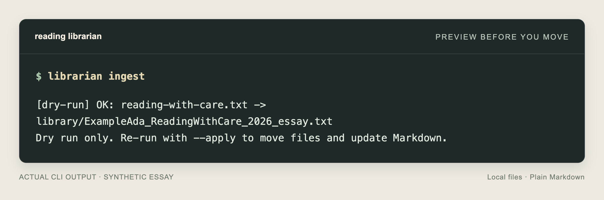
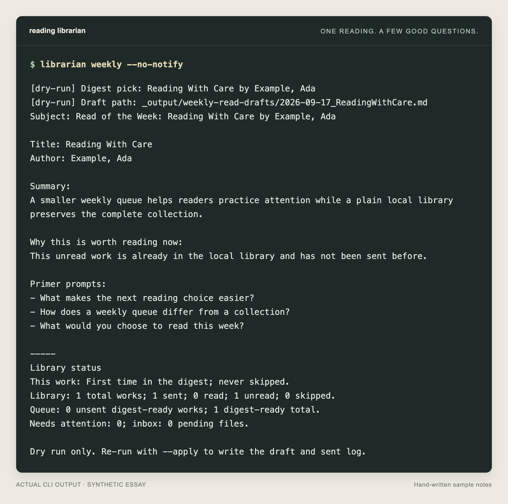

# Try it with one essay

[← Back to the README](../README.md)

See the whole flow with an invented reading: **preview → organize → choose a weekly read**. No provider, account, or delivery setup. The summary and questions in this example are hand-written.

First, finish [installation](../README.md#get-started). Start in the cloned `librarian` directory with the virtual environment active.

## 1. Make a demo workspace

```bash
librarian_source_dir="$PWD"
librarian_demo_dir=$(mktemp -d)
cd "$librarian_demo_dir"
printf 'Your demo is here: %s\n' "$librarian_demo_dir"
librarian mount --check
librarian init
librarian mount --privacy local --model none
librarian mount --privacy local --model none --apply
cp "$librarian_source_dir/tests/fixtures/demo/ExampleAda_ReadingWithCare_2026_essay.txt" inbox/reading-with-care.txt
```

Everything stays in this fresh temporary folder. `init` creates missing workspace files immediately; other changes are previewed before `--apply`. The sample is copied from the repository, so the original stays there.

## 2. Organize it

```bash
librarian ingest
librarian ingest --apply
librarian status
```

The preview names the source and destination. The applied command moves the essay into `library/` and records it in `library/index.md`, including its original filename. Open the index in your text editor to see the entry. It still needs reading notes before it can be a weekly pick.



## 3. Give yourself something to read

In **`library/index.md`**, find the **Reading With Care** entry. Replace these four fields with the lines below, keeping them indented under the entry. Keep two spaces at the end of each field line so Markdown viewers show separate lines. Leave the other fields and headings as they are. These are reviewed notes for this sample only.

```text
  Summary: A smaller weekly queue helps readers practice attention while a plain local library preserves the complete collection.
  Primer prompts: What makes the next reading choice easier? | How does a weekly queue differ from a collection? | What would you choose to read this week?
  Review notes: None.
  Next action: clean
```

Save the index. Then:

```bash
librarian lint
librarian weekly
librarian weekly --apply
```

Lint should report no errors. The preview should pick **Reading With Care** and show your notes. The final command saves a Markdown draft under `_output/weekly-read-drafts/` and marks the pick sent. Nothing is sent to a person or service.



*Screenshots show actual CLI output, typeset for readability. The weekly capture uses `--no-notify` to hide the duplicate terminal notification preview; neither preview sends a desktop notification.*

You now have a reading file, a readable index, and a weekly draft. Open the draft in any text editor. To record that you finished the reading, preview `librarian reply read`, then run `librarian reply read --apply`.

## Use your own readings

Return to the repository workspace:

```bash
cd "$librarian_source_dir"
```

Copy a few readings into `inbox/` and follow the same ingest preview. Add your own notes or explore [optional model setup](mount.md#optional-model-assistance). The demo folder remains at the printed path; nothing is automatically deleted. Temporary folders may be cleaned by your operating system, so keep real readings in a permanent workspace.

Trying this for someone else? Note your OS, Python version, where you got stuck, and whether the preview made the next step clear. [Report feedback](https://github.com/Spencer-Norwick/librarian/issues) using this sample rather than private reading files.
